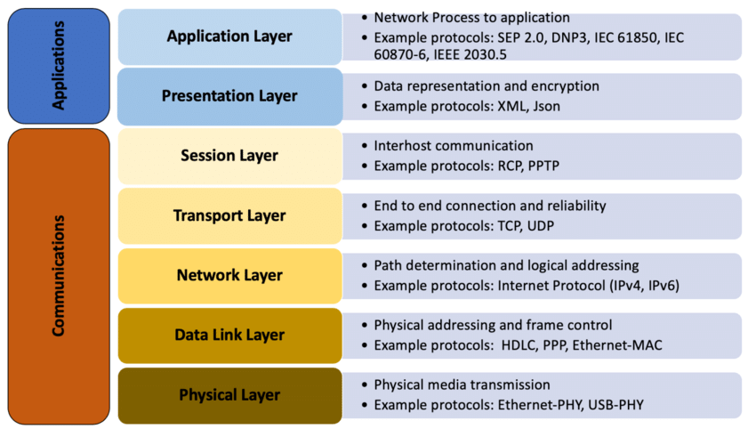
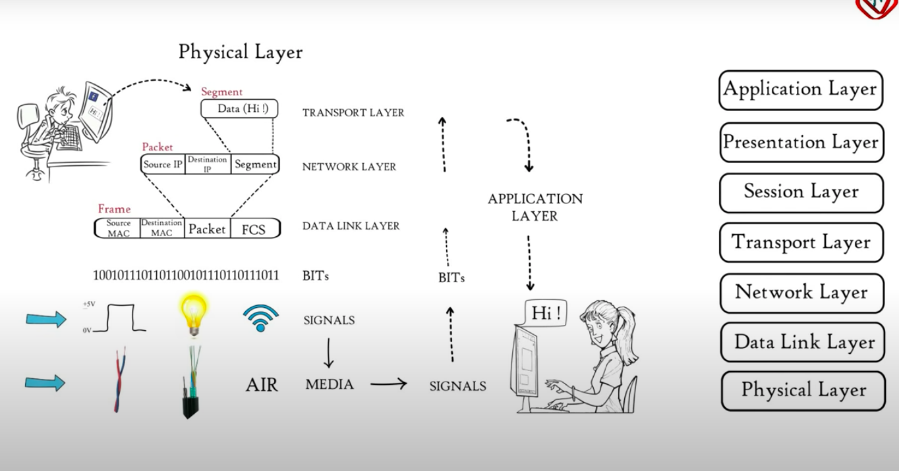

# OSI MODEL

## Abstract

OSI stands for open system interconnection. It is a seven layer architecture with specific protocols to transmit data from one user to another. It standardized the functions performed between two computers in a network while communicating. It was the first standard model for network communication adopted by all major computer and telecommunication companies in the early 1980s. It was introduced in 1983 and adopted by ISO as an international standard in 1984.

## Introduction

A computer network consists of many computers connected to each other via connectors and cables or some other media. When these computers want to communicate with each other their operating system must understand the data sent to them. Since they may or may not be using the same technology, communication will be difficult.

The challenge is how will they communicate if they have different technologies? How do they make a reliable connection and transmit data error free? How will they ensure data is not corrupted?

The solution to all these problems is the OSI Model. To enhance a successful communication between computers with different technology, OSI model is used. It is aimed at providing reliable,secure and fast communication between computers in a network irrespective of their technology. It accomplishes these tasks by dividing its functionality into seven layers using specific protocols in each layer.

## Seven Layers of OSI Model

Each layer in the OSI Model is a package of protocols that has specific functions to perform. These layers are as follows:

1.**Application Layer** - It is the topmost layer of the OSI model which is used by software applications such as web browsers, email etc. to send and receive meaningful data. This layer contains some protocols that are used to make these applications work.

Some of these application layer protocols are:

- ***FTP*** - File Transfer Protocol is used to transfer files over the network.
- ***http,https*** - These protocols are used by users for web surfing.
- ***SMTP,POP,IMAP*** - These  protocols are used to send and receive emails.
- ***Telnet*** - This is used to virtually access a computer by providing a virtual terminal.

2.**Presentation Layer** - Presentation layer takes data transmitted by the application layer and prepares it to transmit over the session layer. It performs three basic functions:

- ***Translation*** - The data received from the application layer is in the form of characters and numbers. Presentation layer converts them into machine readable binary format which is a combination of bits. For e.g- ASCII to EBCDIC.

- ***Data Compression*** - Presentation layer reduces the combination of bits that represents the data. This bit reduction is called data compression. This helps in reducing the size of data to be transmitted and thus makes the transmission faster. This is very helpful in real time video and audio streaming services.

- ***Data Encryption and decryption*** - Before transmitting the data, presentation layer encrypts the data to maintain integrity of data and enhances the security of sensitive data. At the receiver end, the presentation layer encrypts the data and presents it to the application layer. For this it uses secure socket layer protocol(SSL).

3.**Session Layer** - This layer helps in setting up a session or connection to enable transmission and reception of data and termination of connection after that. Three main functions of this layer are:

- ***Authentication*** - Authentication is the process of verifying a user's identity. When a user wants to access a server, the server authenticates it by asking for login id and password and only after the authentication session layer establishes a connection for data transmission.

- ***Authorization*** - Authorization is knowing if a user has permission to access a particular file on a server and if it does not have permission, it denies access to that file otherwise provides access to the user.

- ***Session Management*** - Session layer establishes the connection for data transmission and keeps track of session and when it is done, it terminates the session. This way it helps in session management.

4.**Transport Layer** - Transport Layer receives the data transmitted by the session layer and breaks it into segments. At the receiver's end, it reassembles the segments to form the data to be used by the session layer. Transport layer performs these three functions:

- ***Segmentation and reassembly*** - It divides the data into segments and add following information:
- Port Number - It specifies the application to which data is to be sent.
- Sequence Number - It helps in reassembly of segments in correct order.

- ***Flow Control*** - It controls the amount of data being transmitted from one end to another. Generally two systems have different speeds of processing. To synchronize their speeds and maintain system performance, this layer tells one system to slow down its speed according to another.

- ***Error Control*** - During the transmission process, some data packets may get lost, in that case, the transport layer performs an automatic repeat request to retransmit the corrupted or lost data. It uses a group of bits called checksum to find correct complete data.

Protocols used in Transport layer are:

- TCP - Transmission Control Protocol which provides connection oriented transmission and provides feedback of complete and correct reception of data at destination. This is used where complete transmission is necessary such as email,ftp etc.

- UDP - User Datagram Protocol which provides connectionless transmission and it does not give any feedback that is why it is not used for sensitive data transmission. It is used in downloading videos and movies.

5.**Network Layer** - Network layer transmits data from one computer to another computer which are in different networks. Data units in the network layer are called data packets. This layer performs two main functions:

- ***Logical Addressing*** - Every computer in a network has a unique IP address. Network layer assigns sender's and receiver's IP address to each data packet to ensure data packets reach at correct destination.

- ***Routing*** - Logical addressing by network layer is based on IPV4 or IPV6 format. It adds a mask to each packet which contains four combinations of bits. First three combinations represent the network to which packets need to go and the last represents the host. Based on this information packets are routed to their destination.

- ***Path Determination***- This is one of the most important functions of the network layer as it finds out the shortest path for the packet to reach its destination. To accomplish this, Network layer uses the following protocols:
- OSPF - Open Shortest Path First
- BGF - Border Gateway Protocol
- IS-IS - Intermediate System-Intermediate System

6.**Data Link Layer** - Data link layer is present in the network card interface of a computer as a software which transmits data from one computer to another via local media such as copper wire,optical fiber or air.Data link layer receives data packets from network layer. It is responsible for delivery of data between two physically connected nodes on a network and its main task is to deliver data error free. It breaks packets into frames and sends them from source to destination. Functions performed by data link layer are:

- ***Framing*** - It breaks packets into frames and sends them from source to destination

- ***Physical Addressing*** - After creating data frames, the data link layer adds mac addresses of sender and receiver in the frames. Mac address is a 12 digit alphanumeric number embedded in the network interface card of a computer by a computer manufacturer.

- ***Error Control*** - Data link layer has mechanisms to determine corrupted data frames so it detects them and retransmits the damaged or lost frames.

- ***Flow Control*** - It coordinates the amount of data to be sent before receiving acknowledgement to maintain data rate at both sides.

- ***Access Control*** - It determines which device has control over the channel at a given time.

7.**Physical Layer** - It is the lowest layer of the OSI model. It transmits data in the form of bits between physical nodes. It converts binary sequences into signals and at the receiver, it converts signals into bits and sends them to the data link layer. Functions of physical layer are:

- ***Bit Synchronization*** - It provides a clock that controls sender and receiver and synchronizes them by bits.

- ***Bit Control*** - It defines the transmission rate i.e the no. of bits sent per second.

- ***Physical Topologies*** - It specifies the topologies in which devices are arranged such as star,bus,mesh etc.

- ***Transmission Modes*** - It defines the mode of transmission such as duplex or half duplex. model

 

## Conclusion

To sum up, OSI Model is a standardized model of layers with protocols that facilitate reliable, secure and hassle free communication between two computers connected in a network using different technologies. In seven layers of OSI Model, the topmost four layers work as software layers and lower three layers are part of hardware. Modern internet is not based on OSI but on a simpler TCP/IP Model. However, the OSI model is still being used to visualize and communicate how networks operate and helps troubleshoot which network layer is causing problems.

## References

1.<https://en.wikipedia.org/wiki/OSI_model>

2.<https://www.imperva.com/learn/application-security/osi-model/>

3.<https://www.geeksforgeeks.org/layers-of-osi-model/>

4.<https://www.youtube.com/watch?v=vv4y_uOneC0>
